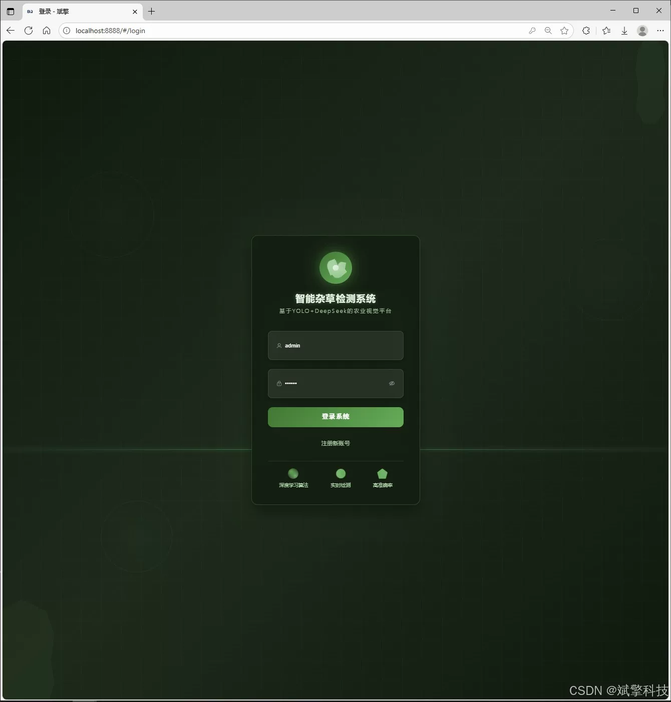
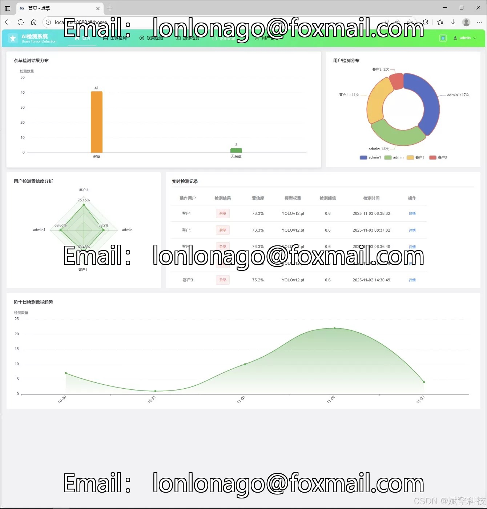
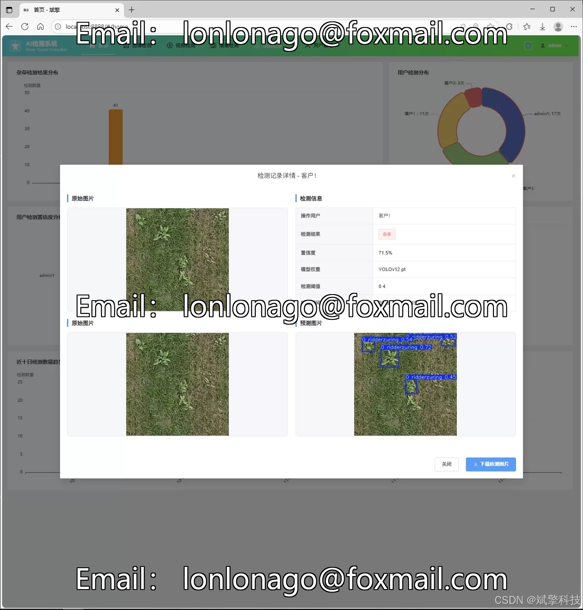
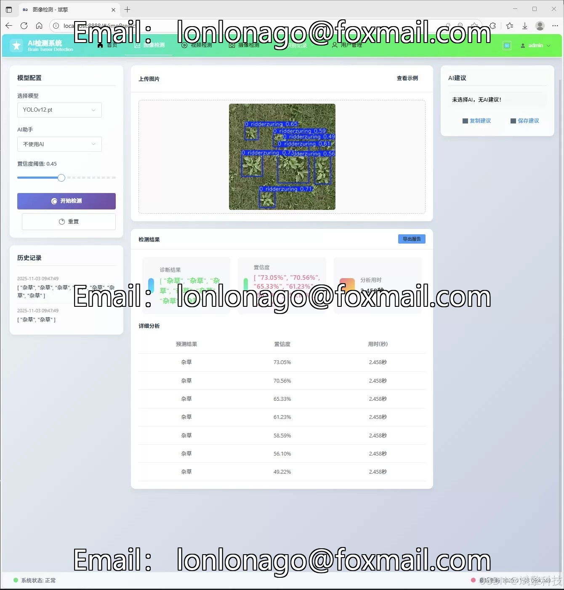
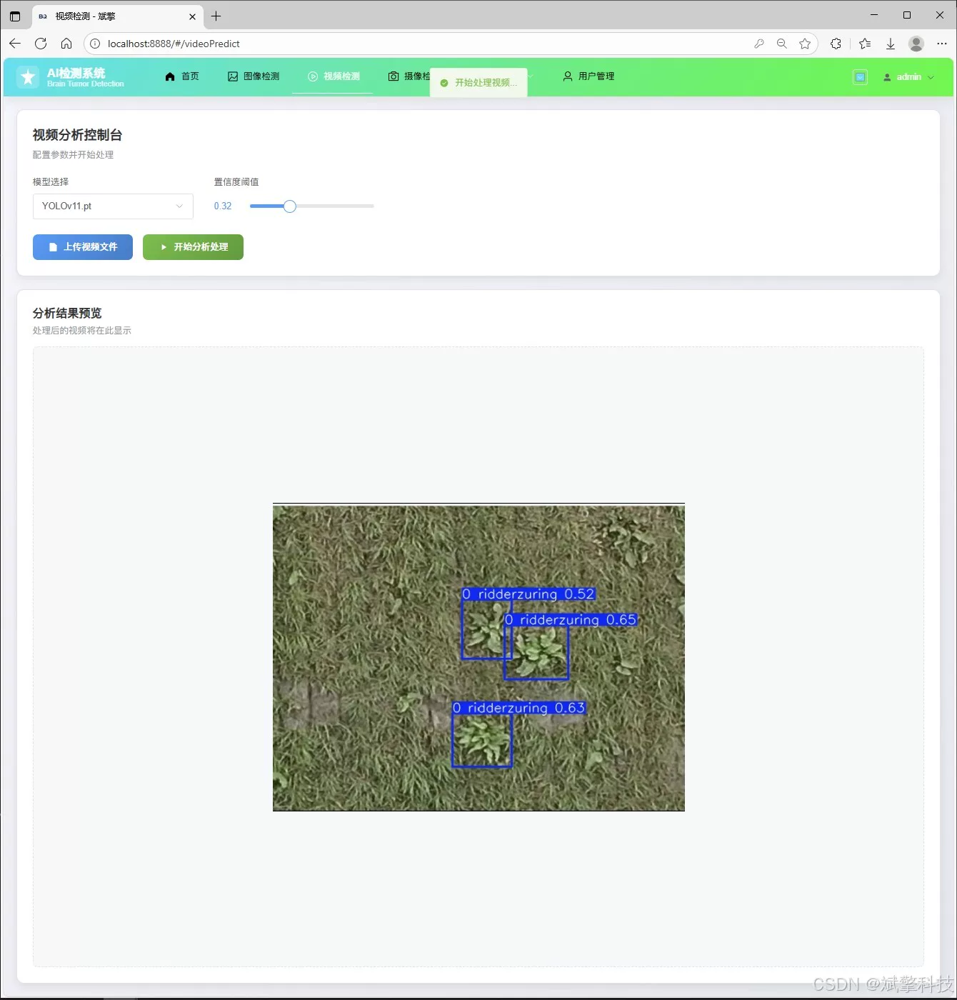
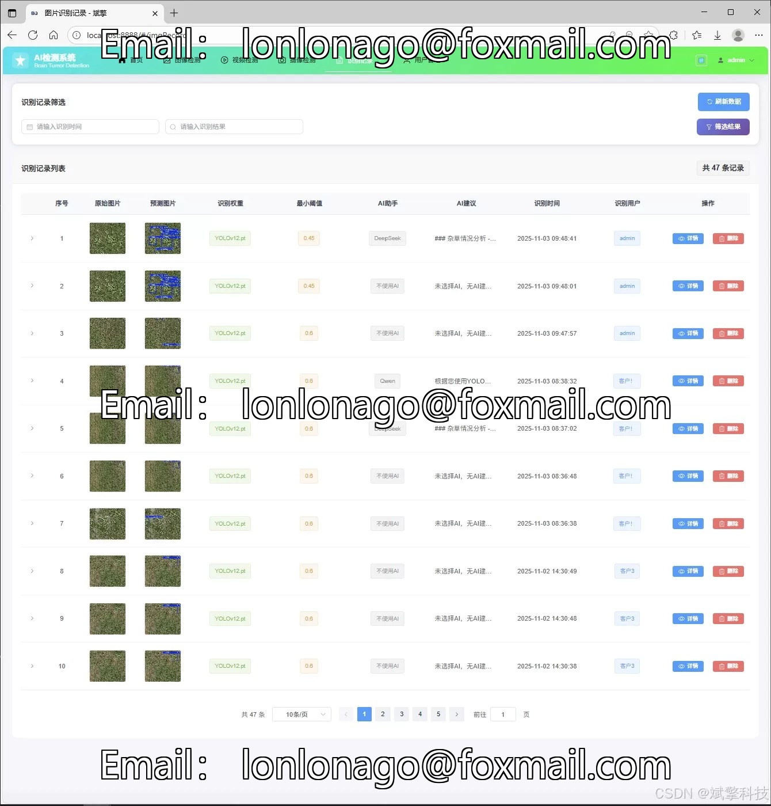
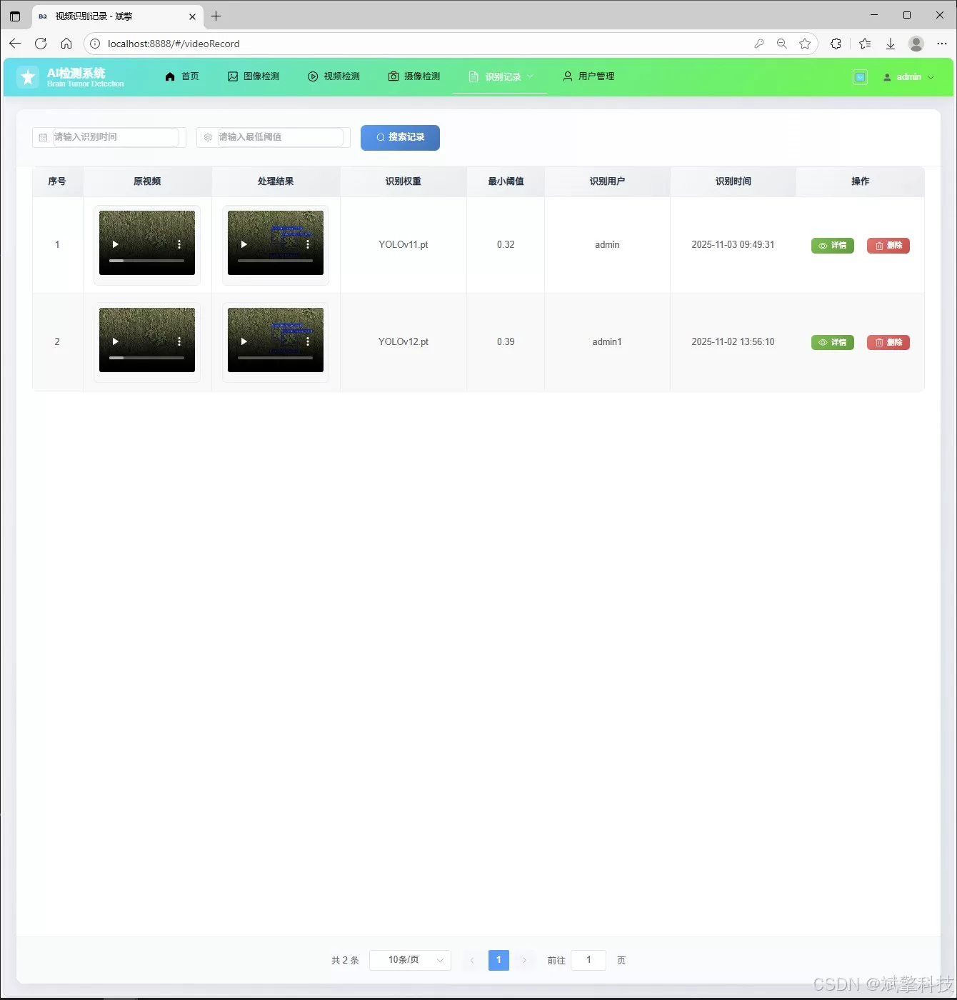
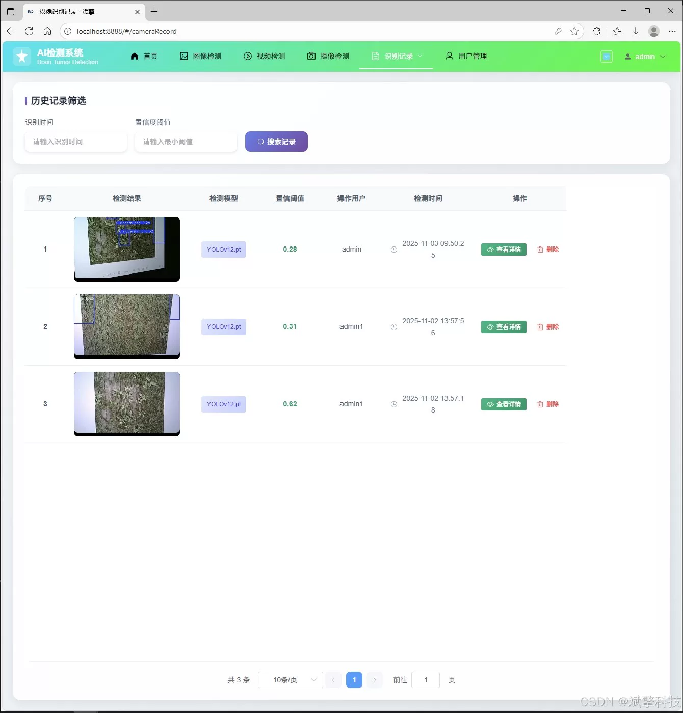
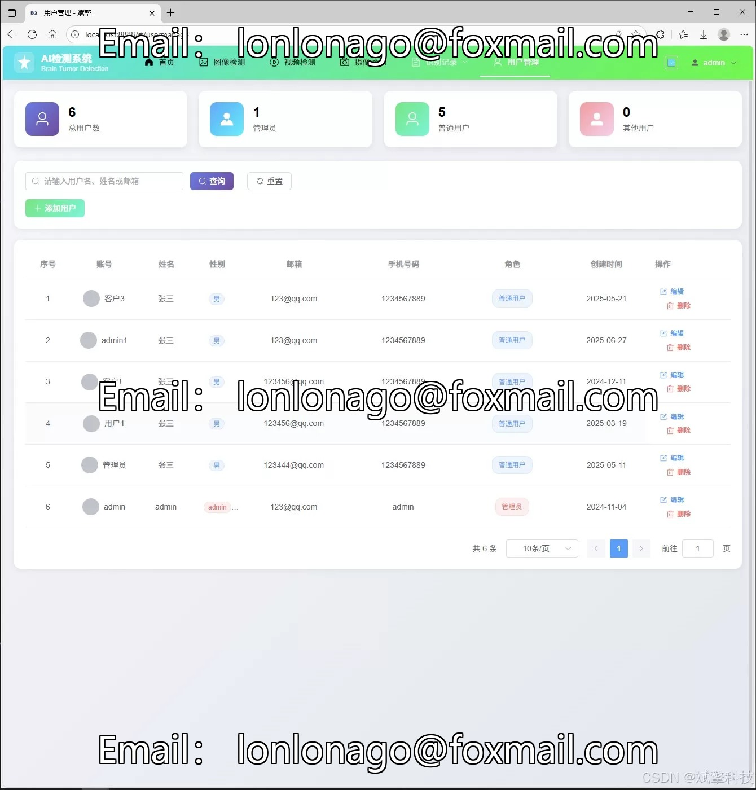

# YOLO+Large Model Weed Intelligent Detection System

## Body

The YOLO+ large model weed intelligent recognition system is based on the deep learning of YOLO and the weed identification detection system (DeepSeek intelligent analysis + web interaction interface + front-end separation + YOLO data + YOLOv8/YOLOv10/YOLOv11/YOLOv12).

This system is a comprehensive intelligent application platform that deeply integrates the cutting-edge deep learning object detection technology, big language model analysis capabilities, and modern enterprise-level Web development frameworks. The system uses high-performance, iterative YOLO series models (covering v8, v10, v11, v12) as its core visual perception engine, specifically used for high-precision, high-efficiency recognition and positioning of specific weed species. Through the robust back-end architecture based on SpringBoot, the system has built a complete set of user authentication, data management, and a clear and intuitive responsive front-end interface, ultimately providing users with a one-stop decision support system for weed control and prevention, including multimodal detection, intelligent analysis, data visualization, record management, and system management.

Functional module

✅ Information Visualization, Data Visualization.

✅ Image detection supports AI analysis functions, deepseek and Qianwen.

✅ Supports image detection, video detection, and real-time camera detection. The results are saved to a MySQL database.

✅ Picture recognition record management, video recognition record management and camera recognition record management.

✅ User Management Module, administrators can add, delete, modify, and query users.

✅ Personal center, can modify their own information, password name profile picture and so on.

There is no Lunwen writing service, nor any Lunwen.

## Images

## Payment

Here is a pay link on Stripe ( https://buy.stripe.com/3cs8yP7sY87d0vu9AB ). Please contact me lonlonago@foxmail.com after funding $89, and I will send you a complete data files , thank you!

